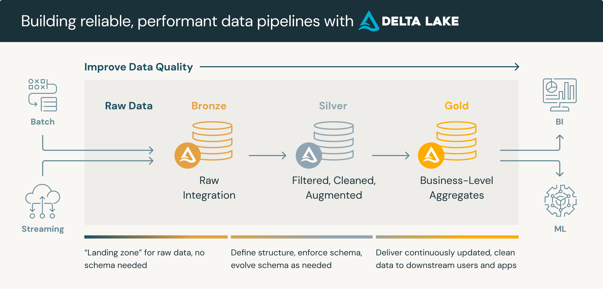

# BEES Data Engineering - Breweries Case - Medallion Data Pipeline

[](https://www.python.org/downloads/)
[](https://spark.apache.org/downloads.html)
[](https://www.prefect.io/)
[](https://delta.io/)

## Project Overview

This project implements a data pipeline following the Medallion architecture for the "Breweries Case" of BEES Data Engineering. The goal is to consume data from the Open Brewery DB API, transform it, and persist it into a Data Lake, organized into Bronze, Silver, and Gold layers. The pipeline orchestration is done with [Prefect](https://www.prefect.io/), and the data processing is done with [PySpark](https://spark.apache.org/).

**Test Objective (BEES Data Engineering):**

* Consume data from the [Open Brewery DB](https://api.openbrewerydb.com/breweries) API.
* Build a data pipeline using an orchestration tool (in this case, Prefect).
* Implement the pipeline in the Medallion architecture (Bronze, Silver, Gold).
* Persist raw data in the Bronze layer.
* Transform and partition data by location in the Silver layer (Delta Lake format).
* Create aggregated views in the Gold layer (number of breweries by type and location).
* Describe a monitoring and alerting strategy.

## Implemented Medallion Architecture

The pipeline follows the Medallion architecture, organizing the data into three main layers:

[Image of Medallion Architecture Breweries Pipeline]



* **Bronze Layer (Raw Data):**
    * **Objective:** Store raw data from the Open Brewery DB API in its original format (JSON), or in a suitable format for initial ingestion.
    * **Implementation:** In this layer, the API data is extracted and saved in Delta Lake format to ensure reliability and versioning from the beginning. The `bronze_pipeline.py` file is responsible for this step.
* **Silver Layer (Curated & Partitioned Data):**
    * **Objective:** Clean, transform, and enrich the data from the Bronze layer. Standardize formats, handle missing data, and remove duplicate data. Partition the data to optimize queries and performance.
    * **Implementation:** The `silver_pipeline.py` script reads the data from the Bronze layer, applies cleaning and standardization transformations (detailed in the code section), and partitions the data by "state" (brewery state) when saving in Delta Lake format.
* **Gold Layer (Aggregated & Analytics-Ready Data):**
    * **Objective:** Create aggregated views and data ready for analysis and reporting. Focus on providing business insights.
    * **Implementation:** The `gold_pipeline.py` script reads the data from the Silver layer and creates aggregations, such as the count of breweries by type and location (city, state, country). These aggregations are saved as Delta Lake tables in the Gold layer, ready for analytical consumption.

## Tools and Technologies Used

* **Programming Language:** Python
* **Data Processing:** PySpark
* **Pipeline Orchestration:** Prefect
* **Data Format:** Delta Lake (for all layers)
* **Code Repository:** GitHub
* **Development Environment (Optional):** Databricks (the pipeline was originally developed and tested on Databricks but can be adapted to other Spark environments)

## Prerequisites and Setup

Before running the pipeline, ensure you have the following prerequisites installed and configured:

1.  **Python:** Version 3.8 or higher installed.
    * You can download Python from: [https://www.python.org/downloads/](https://www.python.org/downloads/)

2.  **PySpark:** Make sure you have PySpark configured and working in your environment.
    * **Installation with pip (for local environment):**
        ```bash
        pip install pyspark
        ```
    * **Databricks Environments:** In Databricks environments, Spark is pre-configured.

3.  **Prefect:** Install the Prefect library for pipeline orchestration.
    ```bash
    pip install prefect
    pip install prefect-cli # (Optional - to use the Prefect CLI)
    ```

4.  **Delta Lake:** Install the Delta Lake connector for PySpark.
    ```bash
    pip install delta-spark
    ```

5.  **Additional Libraries:** Install other necessary Python libraries.
    ```bash
    pip install requests
    ```

## Environment Setup (Local Example)

1.  **Create a virtual environment (recommended):**
    ```bash
    python -m venv venv
    source venv/bin/activate  # On Linux/macOS
    venv\Scripts\activate  # On Windows
    ```

2.  **Install dependencies:**
    ```bash
    pip install -r requirements.txt # (If you create a requirements.txt file with the dependencies)
    # Or install manually:
    pip install pyspark prefect delta-spark requests
    ```

## How to Run the Pipeline

The pipeline can be executed in two ways:

**1. Local Execution (For Testing and Development):**

    a. **Run the Python scripts individually:**
        You can run each Python script (`bronze_pipeline.py`, `silver_pipeline.py`, `gold_pipeline.py`) directly from the command line, in the correct order (Bronze -> Silver -> Gold).

        ```bash
        python brewery_data_pipeline/bronze_pipeline.py
        python brewery_data_pipeline/silver_pipeline.py
        python brewery_data_pipeline/gold_pipeline.py
        ```

    b. **Run the Prefect Flow (For Local Orchestration):**
        To run the pipeline orchestrated by Prefect, use the `prefect_flow.py` script.

        ```bash
        python brewery_data_pipeline/prefect_flow.py
        ```
        This command will run the Prefect flow locally, orchestrating the execution of the defined tasks (bronze, silver, gold) in the correct sequence.

**2. Databricks Execution (Production Environment - Originally Developed for Databricks):**

    a. **Import Notebooks to Databricks:**
        Upload the original IPython notebooks (File 1st, 2nd, and 3rd) or the converted Python scripts (`bronze_pipeline.py`, `silver_pipeline.py`, `gold_pipeline.py` and `pipeline_functions.py`, `prefect_flow.py`) to your Databricks workspace.

    b. **Run Notebooks/Scripts on Databricks:**
        You can run the notebooks/scripts directly on Databricks, in the order Bronze -> Silver -> Gold. If you are using Prefect, run the `prefect_flow.py` script in a Databricks notebook.

    c. **Scheduling on Databricks (Jobs):**
        For regular scheduling on Databricks, you can create Jobs to run the notebooks/scripts at a defined frequency (daily, hourly, etc.).

        * In the Databricks Workspace, go to "Workflows" -> "Jobs" -> "Create Job".
        * Configure the Job to run the `prefect_flow.py` notebook/script (or the individual scripts, if you prefer not to use Prefect for scheduling on Databricks).
        * Define the desired schedule for the Job.

        **Note:** Although Prefect is used for orchestration in this project, in a Databricks environment, Databricks Jobs itself can be used to schedule the execution of notebooks/scripts, especially if you are already familiar with the Databricks environment.

## Code Structure

brewery_data_pipeline/
├──
├── pipeline_functions.py  # Funções reutilizáveis do pipeline (API, salvar Delta)
├── bronze_pipeline.py     # Script Python para a camada Bronze (extração da API, save raw data)
├── silver_pipeline.py     # Script Python para a camada Prata (transformações, limpeza, partição)
├── gold_pipeline.py       # Script Python para a camada Ouro (agregações, data marts)
├── prefect_flow.py        # Script Python com o Flow do Prefect para orquestração
├── README.md              # Este arquivo de documentação
└── requirements.txt       # Lista de dependências Python

* **`pipeline_functions.py`:** Contains reusable Python functions, such as `get_breweries` (to fetch data from the API) and `save_df_to_bronze` (to save DataFrames in Delta Lake format in the Bronze layer).
* **`bronze_pipeline.py`:** Specific Python script for the Bronze layer. Responsible for:
    * Defining the Open Brewery DB API URL.
    * Calling the `get_breweries` function to get the API data.
    * Creating a PySpark DataFrame from the API data.
    * Comparing with existing data in the Bronze layer (to avoid duplicates and process only new data - `subtract` logic).
    * Saving the new data to the Bronze layer using the `save_df_to_bronze` function.
* **`silver_pipeline.py`:** Python script for the Silver layer. Responsible for:
    * Reading data from the Bronze layer (Delta Lake).
    * Applying cleaning and standardization transformations:
        * Removing irrelevant columns (`address_1`, `address_2`, `address_3`).
        * Reorganizing the column order.
        * Removing whitespace from text columns (`trim`).
        * Removing duplicate data (`distinct`).
        * Handling missing data (`fillna` for specific columns).
        * Removing unwanted characters from the phone number (`regexp_replace`).
        * Adding a load date column (`_loadDate`).
        * Converting data types (`cast`).
    * Saving the transformed data to the Silver layer in Delta Lake format, partitioned by `state`.
* **`gold_pipeline.py`:** Python script for the Gold layer. Responsible for:
    * Reading data from the Silver layer (Delta Lake).
    * Performing aggregations to create analytical data marts:
        * Count of breweries by type (`brewery_type`).
        * Count of breweries by location (city, state, country).
        * Count of breweries by type and location (combination).
    * Saving the aggregations as Delta Lake tables in the Gold layer (`gold_cervejarias_por_tipo`, `gold_cervejarias_por_localizacao`, `gold_cervejarias_tipo_localizacao`).
* **`prefect_flow.py`:** Python script that defines the Prefect Flow to orchestrate the pipeline.
    * Defines tasks (`@task`) to run each Python script (bronze, silver, gold).
    * Defines the main Flow (`@flow` - `brewery_pipeline_flow`) to orchestrate tasks in the correct order, with dependencies (`wait_for`) to ensure the Medallion sequence (Bronze -> Silver -> Gold).
    * Allows running the flow locally for testing (`if __name__ == "__main__":`).

## Monitoring and Alerts

For monitoring and alerts of this pipeline, especially in a Databricks environment, the following approaches can be implemented:

* **Databricks Jobs Monitoring:**
    * Databricks Jobs provides basic monitoring of job executions, including status (success, failure), logs, and execution time.
    * Alerts can be configured directly in Databricks Jobs to notify stakeholders in case of job failures.

* **Databricks Custom Alerts:**
    * Use the Databricks custom alerts system to create more specific alert conditions, such as:
        * **Data Quality:** Check if important columns have missing data or are outside an expected range after the pipeline execution.
        * **Pipeline Failures:** Configure alerts for failures in specific pipeline tasks (bronze, silver, gold).
        * **Data Incompleteness:** Alert if an expected number of records was not processed at each stage of the pipeline.
    * Alerts can be configured to notify stakeholders via email, Slack, or other communication channels.

* **Detailed Logging:**
    * Implement detailed logging in each Python script to record relevant information during pipeline execution (task start and end, number of records processed, errors, etc.).
    * Databricks logs can be reviewed for diagnosis and troubleshooting in case of problems.

* **Monitoring Metrics (Optional - More Advanced):**
    * For more advanced monitoring, metrics can be collected during pipeline execution (e.g., execution time of each task, resource consumption, etc.) and sent to external monitoring tools (e.g., Prometheus, Grafana) for visualization and more sophisticated alerts.


## Considerations and Trade-offs

* **Choice of Prefect for Orchestration:**
    * Prefect was chosen as the orchestration tool for its flexibility, ease of use, and features for scheduling, monitoring, and error handling. Other tools like Airflow or Luigi could also be used, but Prefect offers a smoother learning curve for Python data pipelines.
* **Delta Lake Format:**
    * Delta Lake was chosen as the data format for all layers due to its benefits of reliability, versioning, query performance, and support for ACID transactions in Data Lakes. Parquet would also be an option for the Silver layer, but Delta Lake offers additional advantages.
* **Partitioning by "state" in the Silver Layer:**
    * The data was partitioned by "state" in the Silver layer to optimize queries and analyses that frequently filter or aggregate data by state. The choice of partitioning column should be based on query patterns and data usage.
* **Missing Data Handling:**
    * Missing data handling in the Silver layer was simplified for demonstration purposes (`fillna` with default values like "Unknown" or "N/A"). In a real production scenario, missing data handling should be more robust and depend on the analysis of each column and the business context.
* **Monitoring in Databricks:**
    * The monitoring strategy focused on Databricks capabilities, which is the original development environment for this pipeline. In other environments, external monitoring tools could be integrated (e.g., Prometheus, Grafana, log monitoring systems).

## Pipeline Implemented in Databricks (Mentioned in the Test)

This project is a representation in Python scripts of the pipeline originally implemented in Databricks notebooks. The Databricks implementation used the same Medallion architecture and transformation logic, leveraging the scalability and features of the Databricks environment for data processing with Spark and Delta Lake.

For details on the original Databricks implementation, refer to the notebooks (File 1st, 2nd, and 3rd) provided earlier, which were converted to the Python scripts (`bronze_pipeline.py`, `silver_pipeline.py`, `gold_pipeline.py`).

---

**Final Notes:**

* This README provides a comprehensive guide to understanding and running the "Breweries Case" data pipeline.
* Instructions and configurations are provided for a local development environment and the Databricks environment (where the pipeline was originally developed).
* Adapt the settings and steps as needed for your specific environment.
* For questions or problems, refer to the documentation of the tools used (Python, PySpark, Prefect, Delta Lake) or contact the author of this README.